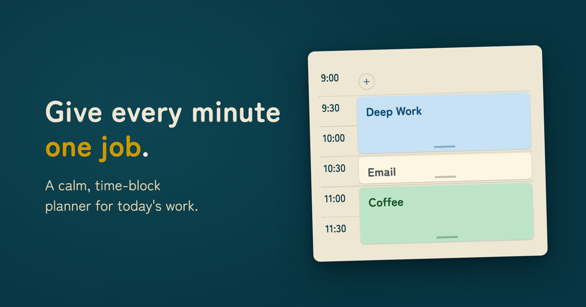
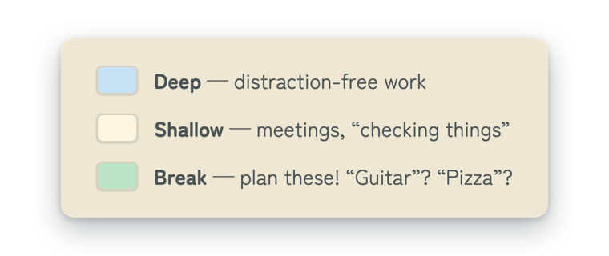

<p align="center">
  
</p>

# unbusy.day

[](https://github.com/GVPproj/unbusy.day/actions/workflows/ci.yml)
[](https://goreportcard.com/report/github.com/GVPproj/unbusy.day)
[](https://go.dev)

Have a structured day. Time-block your schedule, track some progress, no rush.

<p align="center">
  
</p>

## What is this thing?

unbusy.day is a **time-block planning** app, inspired by Cal Newport's
[system](https://calnewport.com/deep-habits-the-importance-of-planning-every-minute-of-your-work-day/).
Time-blocking is giving every minute of your workday **one job**, avoiding the
[costs](https://www.apa.org/topics/research/multitasking) of
[switching contexts](https://calnewport.com/a-productivity-lesson-from-a-classic-arcade-game/)
while you work. It's a less overwhelming, less frantic approach to having a brain.

It's always *today* in the app. Start your day with a clean slate, first adding
any timed commitments, then build out the rest — prioritizing **Deep Work**.
Every block gets one of three types:

<p align="center">
  
</p>

**Drag** blocks to rearrange them, **stretch** them by the grip line at the
bottom. Blocks won't overlap, so things shift naturally into place. Plans
change as the day goes by? Rearrange your blocks; stay in your plan.

## Quickstart

Requires `go` ≥ 1.26 and a few Go tools (no Docker — the database is a local
SQLite file):

```bash
# One-time
go install github.com/go-task/task/v3/cmd/task@latest
go install github.com/a-h/templ/cmd/templ@latest
cp .env.example .env

# Day-to-day
task dev                          # SQLite + templ watch + Go hot reload
```
