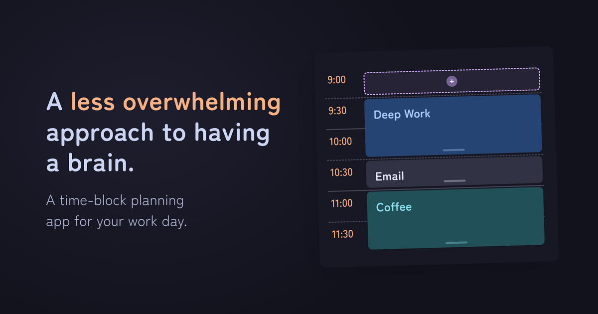
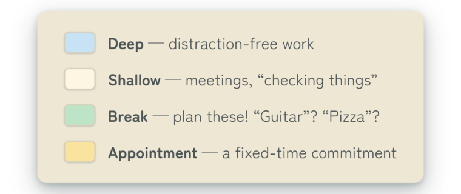

<p align="center">
  
</p>

# unbusy.day

[](https://github.com/GVPproj/unbusy.day/actions/workflows/ci.yml)
[](https://go.dev)

Have a structured day with a time-blocked schedule.



## What is this thing?

unbusy.day is a **time-block planning** app, inspired by Cal Newport's
[system](https://calnewport.com/deep-habits-the-importance-of-planning-every-minute-of-your-work-day/).
Time-blocking is giving every minute of your workday **one job**, avoiding the
[costs](https://www.apa.org/topics/research/multitasking) of
[switching contexts](https://calnewport.com/a-productivity-lesson-from-a-classic-arcade-game/)
while you work. It's a less overwhelming, less frantic approach to having a brain.

It's always *today* in the app. Start your day with a clean slate, first adding
any timed commitments, then build out the rest — prioritizing **Deep Work**.
Every block gets one of four types:

<p align="center">
  
</p>

**Drag** blocks to rearrange them, **stretch** them by the grip line at the
bottom. Blocks won't overlap, so things shift naturally into place. Plans
change as the day goes by? Rearrange your blocks; stay in your plan.

## Quickstart

Requires `go` ≥ 1.26 and a few Go tools (no Docker — the database is a local
SQLite file):

```bash
# One-time
go install github.com/go-task/task/v3/cmd/task@latest
go install "github.com/a-h/templ/cmd/templ@$(go list -m github.com/a-h/templ | awk '{print $2}')"
cp .env.example .env

# Day-to-day
task dev                          # SQLite + templ watch + Go hot reload
```

## Testing

```bash
task test                         # Go + fast JS unit tests
task test:browser:smoke            # Critical Chromium deployment gate
task test:browser                  # Full Chromium regression suite
```

Browser tasks require Node/npm and install pinned Playwright + Chromium. They
build the app, so stop `task dev` before running them. With an existing build:

```bash
scripts/browser-smoke.sh --grep @smoke
scripts/browser-smoke.sh internal/frontend/browsertest/jot-scroll.spec.js
```

Pushes and PRs run Go/JS tests plus the `@smoke` browser tests: login, Jotpad
persistence and cross-tab updates, pending-save blur, block drag persistence,
and habit persistence/live updates/mobile deletion. Keep this gate small
(target: under two minutes of browser execution). Add exhaustive permutations
to the full suite rather than tagging every regression as smoke.

The full suite runs nightly at 03:23 UTC and via **Actions → CI/CD → Run
workflow**, without deploying. Run it locally before risky frontend changes;
nightly failures still need triage, even though they don't block deployment.
Authenticated browser tests get fresh accounts/sessions in the runner's scratch
SQLite file through a test-only Go helper; only the login smoke exercises real OTP.
Production authentication and rate limits are unchanged.

Browser output lists individual timings; CI retains the HTML report and failure
traces/screenshots for seven days. Open a local report with
`npx playwright show-report`.
